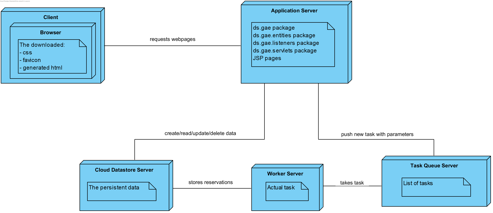

# Google AE
KULeuven Distributed Systems

**Overall score**: 18/20

**Year**: 2019-2020 Master of Science in the Applied Informatics

**Team**:
* [Dries Janse](https://github.com/r0627054)
* [Steven Ghekiere](https://github.com/StevenGhe)

# About

### Indirect communication

The indirect communication takes place at the ’confirm quotes’ step in our application. The
actual confirmation and creation of the reservations is the most demanding process. This part is
the bottleneck activity of the application. By decoupling this part of the application, it allows
the back-end to introduce an additional delay for the processing. The front-end will achieve
better availability and performance because it does not have to wait for the actual creation of the
reservations. The CarRentalModel, which contains the confirmQuotes method, will push a task to
the task queue service. The task queue service will then send a http post request to the worker
with the worker url and the serialized parameters. The worker will execute the task. In this case it
tries to create reservations for all the quotes, making use of a transaction.

### Data passed

Instances of the ’PayloadWrapper’ class are passed between the front- and back-end. This class has
a list of quotes, the name of the renter and the email of the renter. The confirmQuotes method in
the CarRentalModel class will create an instance of the PayloadWrapper class. This instance will
be serialized to a byte array and given to a TaskOptions object. This TaskOptions object will be
pushed to a queue and the worker will execute the task.

  

In our solution we made use to pass this data by value. Passing this data by value requires
network traffic for sending the data to the Worker servlet. It is possible to persist data and only
pass the reference, but in this context it makes less sense. This will result in storing the content of
the PayloadWrapper class in the database which will have to be done by the front-end. Because
this is more work for the front-end, it will downgrade the user experience. A second disadvantage
is that the worker has to interact more with the database. This can result in lower performance.

### Backchannel

We used an email service to let the customer know if their reservations were made. When a
client confirms a quote, the client-side will create a task in the queue and the user is redirected
to another page which shows the message that the reservation is received by the server. When
the task has been executed, the worker will send another email to the customer. This could either
be a success or failure email, since there could be a conflict with the current reservations and the
requested reservations at the point of execution. Either way, we supply the list of reservations in
this mail to make sure the customer has all the details.

We chose this kind of backchannel instead of a status message on the website, since we feel
like a customer will never leave the website open for hours/days to track their progress.

### Scalability

Since the bottleneck transactions are executed on a different servlet (which could run on a totally
different server) and are simply called with an URL and a payload, the load on the client-side
server is reduced. This way we can separate the load on servers, which improves scalability

### NoSQL database scalability and availability

Most standard SQL databases are vertically scalable, which means the system admins can increase
the load on the server by adding or improving hardware components (RAM, SDD, CPU, ...). The
fact that NoSQL have very little functionality built in, makes the operations very basic and very
quick. Since the database doesn’t have to do a lot of complex work and handling difficult locks, it
is really easy to partition the data sets across many servers/disks. Thus, NoSQL databases can
be scaled horizontally, which means multiple servers can handle the same database. Obviously a
NoSQL database can be scaled vertically as well. NoSQL is preferred when choosing for large or
constantly evolving data sets.
Since we can replicate the data very easily, this means that availability will go up as well. Since
multiple copies on different servers are stored, these will decrease the overall risk of losing the data.

### ConfirmQuote

The single ‘confirmQuote’ does not need an explicit transaction, because when we try to confirm
the quote, it will look for available cars. If there are no available cars found, the server will never
create a Reservation. Thus we never need to cancel the transaction, since no data is stored in the
store. The multiple ‘confirmQuotes’ does need a transaction because we want to make sure the
changes are treated as a whole. If any of the reservations fail, all of them should revert and the
data is never committed.

An alternative for this ‘confirmQuotes’ method could be that we don’t use a transaction, and
implement the rollback functionality ourselves. This results in more traffic between the worker
and the datastore. This is because after confirming a quote, we have to check if any conflicts
occurred. If so, we need to cancel each prior reservation, which results in even more calls and
worse performance for both the worker and the datastore. To ensure data consistency, we have
to use only one worker for the task queue or use synchronisation in the worker. Otherwise data
inconsistency can occur because multiple workers can edit the same data.

  
### Deployment diagram

### NoSQL Entities Structure

  
